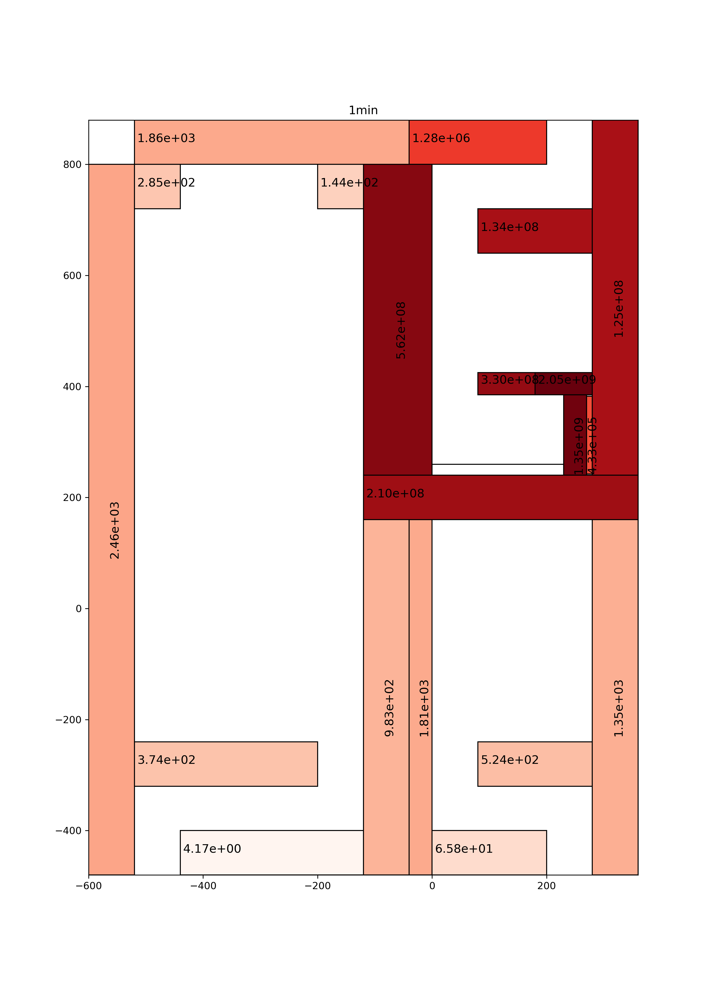

# Intro

here are some scripts and modules I have been using to

- extract neutron spectrum from MCNP
- create inputs and fluxes files for FISPACT-II
- run FISPACT-II inputs
- extract gamma spectrum from FISPACT-II inventory outputs
- create sdef for cells of interest based on the gamma spectra obtained in the previous step

Some of the modules are quite general (though not fully developed and tested).
Such as the FGS2M.py module can be used for any general case, define your mcnp cells, the path for your inventory.out file, give the cooling time of interest and the sdef will be generated. An example sdef is given in sdefzsOpen1min.

The other parts are rather problem specific, with some tuning they can be useful for other problems.
Things still run in a semiautomatic manner. 
It needs to be run in the following order:

1. runAllFluxConvert.py: if you already have the mcnp output (in my case all the tallies are named with cellname and 4 appended to the end (eg. for cell 2310, the tally is 23104).
it needs a volumesandmats.txt file, which is just a print table 50 from mcnp. It also needs some reference fispact input files, which will be updated based on the fluxes and masses (these are not included here). Then first a dictionary is created which keeps track of all cells/tallies, the materials, the densities.
Then makes the flux conversion from 680 group to 709. Finally it runs the inventory calculation.

2.  getCellBoundaries.py: considers that the mcnp cell and surface definitions are in a separate file, and it extracts the cell and surface info from these for each tally/cell. This works now for cases when the cells are bounded by px py pz planes or rpp macrobodies. It certainly cannot handle universes. This creates a ´limits´ dictionary storing info on the x, y, z boundaries.

3, FGS2M.py : this module and the related main will create the Cell objects based on the info stored in the previously created dictionaries. Then it creates a source object, and sdef source definition for that object. Also the main of this module is going to create some plots of the gamma spectra, and the pz and py cuts of the geometry colored according to the source rate. An example is given below

#Contributing, bugs, suggestions

Any reported bug or suggestion is appreciated, please open a new issue. If you would like to contribute, do not hesitate to contact me. 

#Disclaimer

this is very much in development, rather just a backup of my scripts, and probably will not be made more generic.

